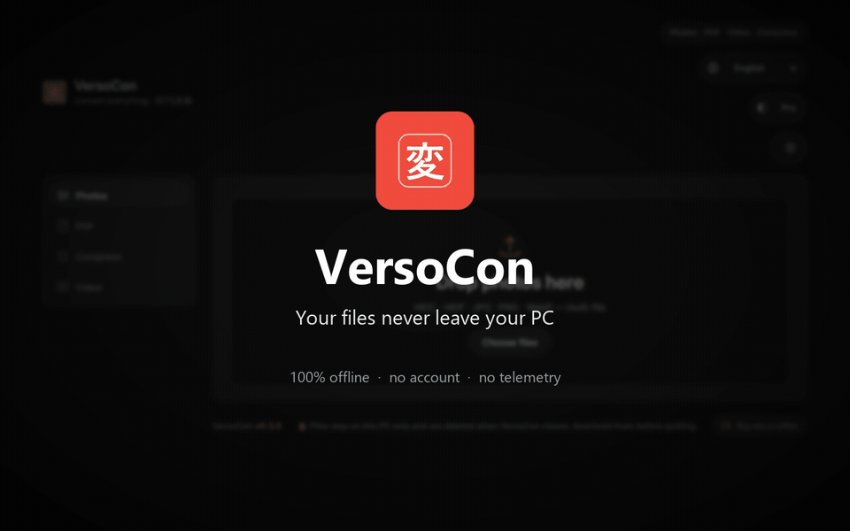

# VersoCon 変

> **Convert photos, PDFs, and videos — 100% on your own machine.** No cloud, no account, no upload: your files never leave your PC.

[](LICENSE.md)
[](requirements.txt)
[](#)
[](#)
[](https://ko-fi.com/hikari22)

<p align="center">
  
</p>

<p align="center">
  <a href="https://ko-fi.com/hikari22" target="_blank">
    
  </a>
</p>

<p align="center" style="line-height:1.6; max-width:62ch; margin:8px auto 20px;">
  💗 <b>VersoCon is free &amp; 100% local.</b><br>
  If it saves you time, a
  <a href="https://ko-fi.com/hikari22" target="_blank" style="text-decoration:none; font-weight:600; color:inherit;">coffee for the dev</a> ☕
  would be a lovely thank-you — <i>zero strings, full support</i>.
</p>

VersoCon is a file converter with a **shonen-manga-styled** desktop UI. It handles HEIC photos, PDFs (edit, sign, merge, compress, extract text), and video transcode — **all locally**. Available in **Italian and English** (switchable via the in-app language selector); more languages are on the roadmap.

## ⚡ Why VersoCon

- 🔒 **Total privacy**: everything runs on `127.0.0.1`, nothing ever goes online.
- 📸 **Native HEIC**: open and convert iPhone photos (`.heic`) without any third-party app.
- 📄 **Full PDF kit**: live preview editor, signature (drawn or generated from your name), reordering, rotation, watermark, merge & split.
- 🎬 **Video**: MP4/WebM transcode (if you have `ffmpeg`).
- 🪶 **Lightweight & offline**: one executable, no web services, no telemetry.
- 🎨 **Careful UI**: shonen manga theme, drag & drop, toasts, animations.

## ✨ Features

| Area | What it does |
|------|-------------|
| **Photos** | HEIC / HEIF / JPG / PNG / WebP / BMP / TIFF / GIF → JPEG, PNG or WebP. Quality slider, max-side resize, EXIF / rotation preserved, animated GIFs kept, batch up to 500 files, single download or ZIP. |
| **PDF** | PDF → images · images → PDF · merge · split · batch rename. |
| **PDF Editor** | In-browser live preview, drawn or text-generated signature (4 calligraphy styles), signature from image, free placement / resize, rotation and opacity, watermark, reorder / rotate / delete pages, text. |
| **Compress** | Shrink images (target bytes or quality) and PDFs (low/medium/high), with a "saved %" badge. |
| **PDF → text** | Plain-text extraction and OCR (Tesseract, optional). |
| **Video** | Transcode to MP4 or WebM (requires `ffmpeg`). |

## 🚀 Installation

### From installer / store (recommended)
- **Windows**: download `versocon-setup-X.Y.Z.exe` from [Releases](https://github.com/hikarihasegawa/versocon/releases) and run it. Or, when available: `winget install HikariHasegawa.VersoCon` / `scoop install versocon`.
- **Linux**: `.deb` for apt or portable `AppImage` from [Releases](https://github.com/hikarihasegawa/versocon/releases).

> Every platform: local install, no account required.

> ### 🛡️ "Windows protected your PC" (SmartScreen)
>
> On first launch Windows may show a SmartScreen warning because VersoCon is not yet
> **code-signed** — normal for unsigned open-source software.
>
> **VersoCon is 100% local, open-source, no telemetry, no account required.**
>
> Before you proceed:
> 1. Verify the **SHA-256** checksum (v0.2.5):
>    `5E7A03FB41C8CCFE6987424B15E4A2B341ADA8AE27E621E8279D6E506BA7532D`
>    (full hash on the [Releases page](https://github.com/hikarihasegawa/versocon/releases)).
> 2. *(Optional)* Upload the installer to
>    [VirusTotal](https://www.virustotal.com/gui/home/url), and check the result.
>
> If OK → click **More info → Run anyway / Esegui comunque**.
>
> Prefer no warning at all? Install via:
> ```
> winget install HikariHasegawa.VersoCon    # official Windows package manager (submission under review)
> scoop install versocon                     # curated community bucket (live)
> ```
> Both channels are reviewed and eliminate SmartScreen alerts over time.
>
> 📄 [Full "Is it safe?" guide (EN/IT) → docs/security.md](docs/security.md)

### From source

```bash
git clone https://github.com/hikarihasegawa/versocon.git
cd versocon
python -m venv .venv

# Windows
.venv\Scripts\activate
# Linux / macOS
# source .venv/bin/activate

pip install --upgrade pip
pip install -r requirements.txt

# Optional OCR (Tesseract on the system + pytesseract)
pip install -r requirements-ocr.txt
```

Or use the setup scripts (which also install Tesseract):

```powershell
# Windows (PowerShell)
powershell -ExecutionPolicy Bypass -File .\install.ps1
```

```bash
# Linux / macOS
bash install.sh
```

### Running

```bash
python run.py              # desktop window (pywebview) or browser if unavailable
python run.py --browser    # force the default browser
# or, without pywebview:
python -m uvicorn app.main:app --host 127.0.0.1 --port 8321
# then open: http://127.0.0.1:8321
```

## 📋 Requirements

- **Python 3.11+** for running from source.
- **Base dependencies**: `fastapi`, `uvicorn`, `pillow`, `pillow-heif`, `pymupdf`, `pywebview` (see `requirements.txt`).
- **Optional**:
  - `ffmpeg` on your PATH for video conversion.
  - `Tesseract` for OCR (optional).

## 🗂️ Project structure

```
versocon/
├─ app/            # FastAPI: API endpoints + constants
├─ converters/     # conversion logic (images, documents, video, PDF, signature, compression)
├─ static/         # frontend HTML+CSS+JS (no build step) + vendor (pdf.js)
├─ assets/         # fonts, logo, demo
├─ packaging/      # PyInstaller spec, icons, Inno Setup, make_icon
├─ tests/          # pytest suite
├─ run.py          # desktop/browser launcher
├─ requirements.txt
└─ PROGRESS.md     # dev state & roadmap (source of truth)
```

## 🧪 Tests

```bash
.venv\Scripts\python -m pytest tests -q   # Windows
# or:
python -m pytest tests -q
```

## 🤝 Contributing & support

Open an issue or a pull request. If it's useful to you, you can
[sponsor the development ☕](https://ko-fi.com/hikari22).

## 📄 License

[MIT](LICENSE.md) — free to use, modify, and redistribute.
